# 分布式时间戳系统 - 用例时序文档

## 概述

本文档详细描述了分布式时间戳与事务管理系统中所有主要用例的时序图和交互流程。每个用例都包含完整的参与者交互、消息传递和状态变化。

## 目录

1. [Lamport时间戳用例](#1-lamport时间戳用例)
2. [版本向量用例](#2-版本向量用例)
3. [向量时钟用例](#3-向量时钟用例)
4. [分布式事务用例](#4-分布式事务用例)
5. [节点同步用例](#5-节点同步用例)
6. [故障恢复用例](#6-故障恢复用例)

---

## 1. Lamport时间戳用例

### 1.1 创建时间戳事件

**参与者**: Client, DTS Service, MySQL, Redis

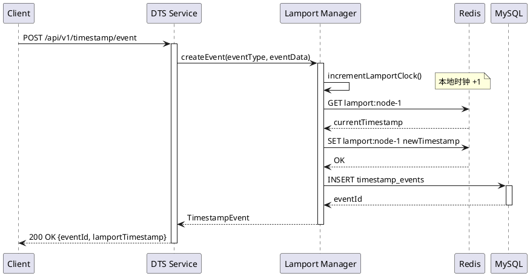
```plantuml
@startuml
participant Client
participant "DTS Service" as DTS
participant "Lamport Manager" as LM
participant Redis
participant MySQL

Client -> DTS: POST /api/v1/timestamp/event
activate DTS

DTS -> LM: createEvent(eventType, eventData)
activate LM

LM -> LM: incrementLamportClock()
note right: 本地时钟 +1

LM -> Redis: GET lamport:node-1
Redis --> LM: currentTimestamp

LM -> Redis: SET lamport:node-1 newTimestamp
Redis --> LM: OK

LM -> MySQL: INSERT timestamp_events
activate MySQL
MySQL --> LM: eventId
deactivate MySQL

LM --> DTS: TimestampEvent
deactivate LM

DTS --> Client: 200 OK {eventId, lamportTimestamp}
deactivate DTS
@enduml
```

**流程说明**:
1. 客户端发起创建时间戳事件请求
2. DTS服务调用Lamport管理器创建事件
3. Lamport管理器递增本地时钟
4. 从Redis获取当前时间戳并更新
5. 将事件持久化到MySQL
6. 返回事件ID和时间戳给客户端

### 1.2 同步时间戳事件

**参与者**: Node A, Node B, DTS Service, MySQL, Redis

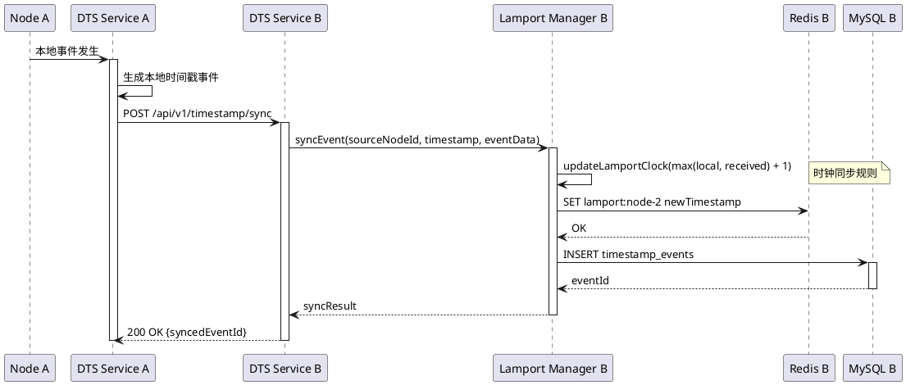
```plantuml
@startuml
participant "Node A" as NodeA
participant "DTS Service A" as DTSA
participant "DTS Service B" as DTSB
participant "Lamport Manager B" as LMB
participant "Redis B" as RedisB
participant "MySQL B" as MySQLB

NodeA -> DTSA: 本地事件发生
activate DTSA

DTSA -> DTSA: 生成本地时间戳事件
DTSA -> DTSB: POST /api/v1/timestamp/sync
activate DTSB

DTSB -> LMB: syncEvent(sourceNodeId, timestamp, eventData)
activate LMB

LMB -> LMB: updateLamportClock(max(local, received) + 1)
note right: 时钟同步规则

LMB -> RedisB: SET lamport:node-2 newTimestamp
RedisB --> LMB: OK

LMB -> MySQLB: INSERT timestamp_events
activate MySQLB
MySQLB --> LMB: eventId
deactivate MySQLB

LMB --> DTSB: syncResult
deactivate LMB

DTSB --> DTSA: 200 OK {syncedEventId}
deactivate DTSB
deactivate DTSA
@enduml
```

---

## 2. 版本向量用例

### 2.1 版本向量递增

**参与者**: Client, DTS Service, Version Vector Manager, Redis, MySQL

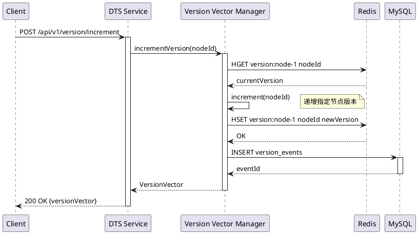
```plantuml
@startuml
participant Client
participant "DTS Service" as DTS
participant "Version Vector Manager" as VVM
participant Redis
participant MySQL

Client -> DTS: POST /api/v1/version/increment
activate DTS

DTS -> VVM: incrementVersion(nodeId)
activate VVM

VVM -> Redis: HGET version:node-1 nodeId
Redis --> VVM: currentVersion

VVM -> VVM: increment(nodeId)
note right: 递增指定节点版本

VVM -> Redis: HSET version:node-1 nodeId newVersion
Redis --> VVM: OK

VVM -> MySQL: INSERT version_events
activate MySQL
MySQL --> VVM: eventId
deactivate MySQL

VVM --> DTS: VersionVector
deactivate VVM

DTS --> Client: 200 OK {versionVector}
deactivate DTS
@enduml
```

### 2.2 版本向量合并

**参与者**: Node A, Node B, Version Vector Manager

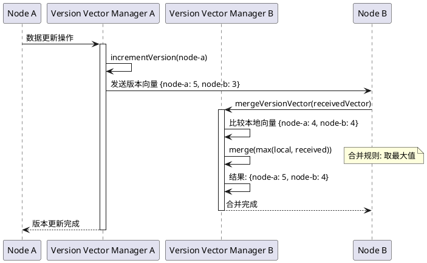
```plantuml
@startuml
participant "Node A" as NodeA
participant "Version Vector Manager A" as VVMA
participant "Version Vector Manager B" as VVMB
participant "Node B" as NodeB

NodeA -> VVMA: 数据更新操作
activate VVMA

VVMA -> VVMA: incrementVersion(node-a)
VVMA -> NodeB: 发送版本向量 {node-a: 5, node-b: 3}

NodeB -> VVMB: mergeVersionVector(receivedVector)
activate VVMB

VVMB -> VVMB: 比较本地向量 {node-a: 4, node-b: 4}
VVMB -> VVMB: merge(max(local, received))
note right: 合并规则: 取最大值

VVMB -> VVMB: 结果: {node-a: 5, node-b: 4}
VVMB --> NodeB: 合并完成
deactivate VVMB

VVMA --> NodeA: 版本更新完成
deactivate VVMA
@enduml
```

---

## 3. 向量时钟用例

### 3.1 向量时钟比较

**参与者**: Client, DTS Service, Vector Clock Manager

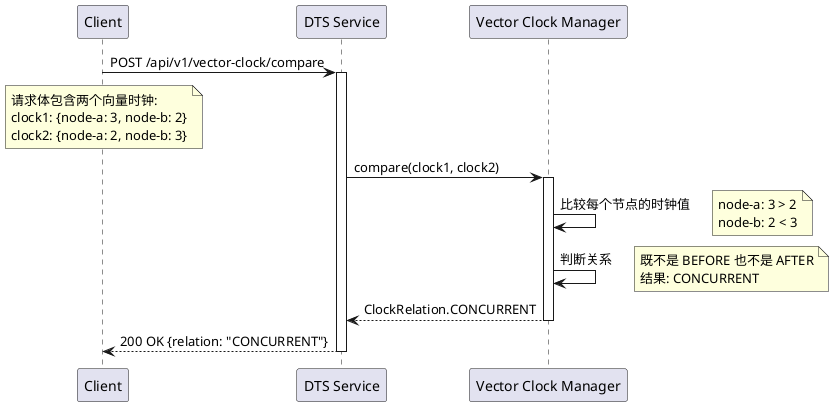
```plantuml
@startuml
participant Client
participant "DTS Service" as DTS
participant "Vector Clock Manager" as VCM

Client -> DTS: POST /api/v1/vector-clock/compare
activate DTS

note over Client: 请求体包含两个向量时钟:\nclock1: {node-a: 3, node-b: 2}\nclock2: {node-a: 2, node-b: 3}

DTS -> VCM: compare(clock1, clock2)
activate VCM

VCM -> VCM: 比较每个节点的时钟值
note right: node-a: 3 > 2\nnode-b: 2 < 3

VCM -> VCM: 判断关系
note right: 既不是 BEFORE 也不是 AFTER\n结果: CONCURRENT

VCM --> DTS: ClockRelation.CONCURRENT
deactivate VCM

DTS --> Client: 200 OK {relation: "CONCURRENT"}
deactivate DTS
@enduml
```

### 3.2 向量时钟同步

**参与者**: Node A, Node B, Vector Clock Manager

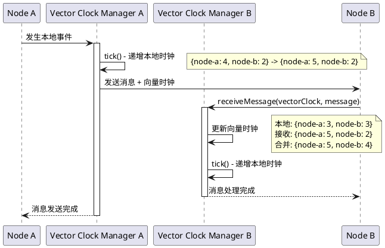
```plantuml
@startuml
participant "Node A" as NodeA
participant "Vector Clock Manager A" as VCMA
participant "Vector Clock Manager B" as VCMB
participant "Node B" as NodeB

NodeA -> VCMA: 发生本地事件
activate VCMA

VCMA -> VCMA: tick() - 递增本地时钟
note right: {node-a: 4, node-b: 2} -> {node-a: 5, node-b: 2}

VCMA -> NodeB: 发送消息 + 向量时钟
NodeB -> VCMB: receiveMessage(vectorClock, message)
activate VCMB

VCMB -> VCMB: 更新向量时钟
note right: 本地: {node-a: 3, node-b: 3}\n接收: {node-a: 5, node-b: 2}\n合并: {node-a: 5, node-b: 4}

VCMB -> VCMB: tick() - 递增本地时钟
VCMB --> NodeB: 消息处理完成
deactivate VCMB

VCMA --> NodeA: 消息发送完成
deactivate VCMA
@enduml
```

---

## 4. 分布式事务用例

### 4.1 Seata AT模式事务

**参与者**: Client, Transaction Manager, Resource Manager A, Resource Manager B, MySQL A, MySQL B

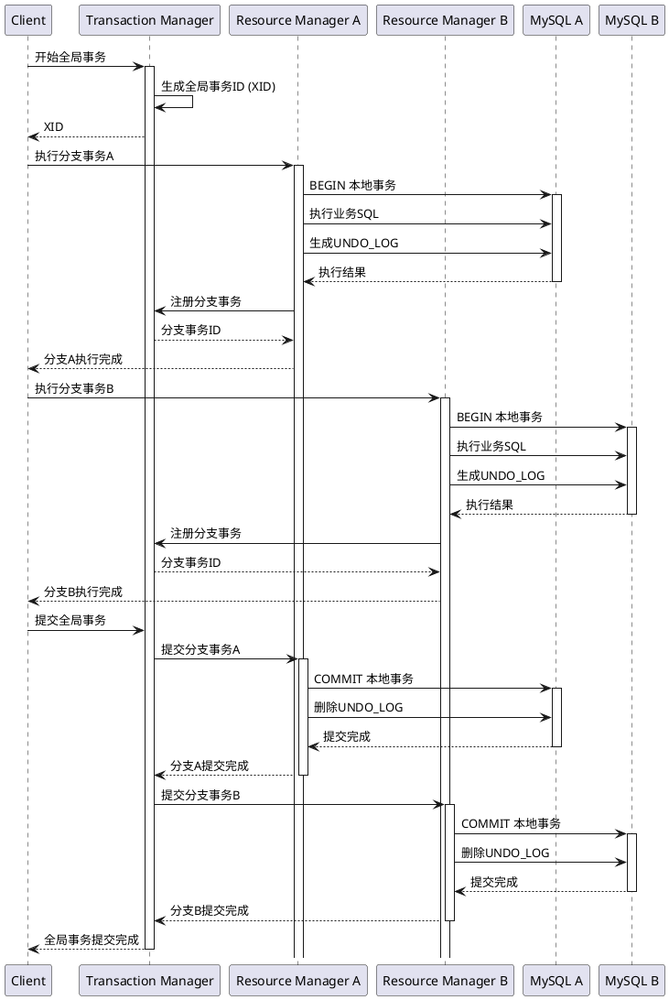
```plantuml
@startuml
participant Client
participant "Transaction Manager" as TM
participant "Resource Manager A" as RMA
participant "Resource Manager B" as RMB
participant "MySQL A" as DBA
participant "MySQL B" as DBB

Client -> TM: 开始全局事务
activate TM

TM -> TM: 生成全局事务ID (XID)
TM --> Client: XID

Client -> RMA: 执行分支事务A
activate RMA

RMA -> DBA: BEGIN 本地事务
activate DBA
RMA -> DBA: 执行业务SQL
RMA -> DBA: 生成UNDO_LOG
DBA --> RMA: 执行结果
deactivate DBA

RMA -> TM: 注册分支事务
TM --> RMA: 分支事务ID

RMA --> Client: 分支A执行完成

Client -> RMB: 执行分支事务B
activate RMB

RMB -> DBB: BEGIN 本地事务
activate DBB
RMB -> DBB: 执行业务SQL
RMB -> DBB: 生成UNDO_LOG
DBB --> RMB: 执行结果
deactivate DBB

RMB -> TM: 注册分支事务
TM --> RMB: 分支事务ID

RMB --> Client: 分支B执行完成

Client -> TM: 提交全局事务
TM -> RMA: 提交分支事务A
activate RMA
RMA -> DBA: COMMIT 本地事务
activate DBA
RMA -> DBA: 删除UNDO_LOG
DBA --> RMA: 提交完成
deactivate DBA
RMA --> TM: 分支A提交完成
deactivate RMA

TM -> RMB: 提交分支事务B
activate RMB
RMB -> DBB: COMMIT 本地事务
activate DBB
RMB -> DBB: 删除UNDO_LOG
DBB --> RMB: 提交完成
deactivate DBB
RMB --> TM: 分支B提交完成
deactivate RMB

TM --> Client: 全局事务提交完成
deactivate TM
@enduml
```

### 4.2 Seata TCC模式事务

**参与者**: Client, Transaction Manager, TCC Service A, TCC Service B

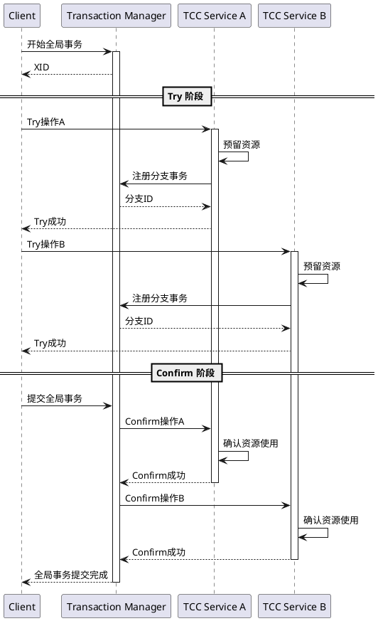
```plantuml
@startuml
participant Client
participant "Transaction Manager" as TM
participant "TCC Service A" as TCCA
participant "TCC Service B" as TCCB

Client -> TM: 开始全局事务
activate TM
TM --> Client: XID

== Try 阶段 ==
Client -> TCCA: Try操作A
activate TCCA
TCCA -> TCCA: 预留资源
TCCA -> TM: 注册分支事务
TM --> TCCA: 分支ID
TCCA --> Client: Try成功

Client -> TCCB: Try操作B
activate TCCB
TCCB -> TCCB: 预留资源
TCCB -> TM: 注册分支事务
TM --> TCCB: 分支ID
TCCB --> Client: Try成功

== Confirm 阶段 ==
Client -> TM: 提交全局事务
TM -> TCCA: Confirm操作A
TCCA -> TCCA: 确认资源使用
TCCA --> TM: Confirm成功
deactivate TCCA

TM -> TCCB: Confirm操作B
TCCB -> TCCB: 确认资源使用
TCCB --> TM: Confirm成功
deactivate TCCB

TM --> Client: 全局事务提交完成
deactivate TM
@enduml
```

### 4.3 Seata SAGA模式事务

**参与者**: Client, SAGA Engine, Service A, Service B, Service C

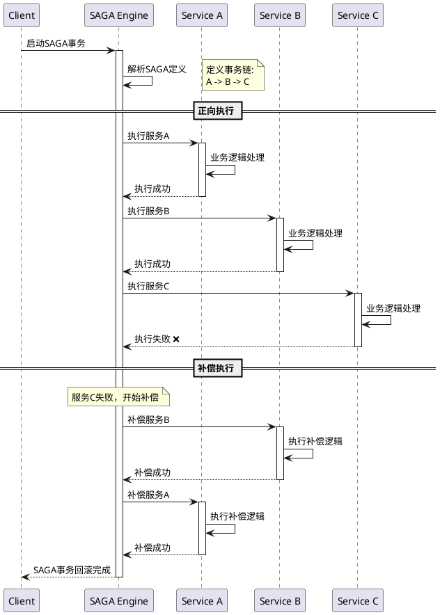
```plantuml
@startuml
participant Client
participant "SAGA Engine" as SAGA
participant "Service A" as SA
participant "Service B" as SB
participant "Service C" as SC

Client -> SAGA: 启动SAGA事务
activate SAGA

SAGA -> SAGA: 解析SAGA定义
note right: 定义事务链:\nA -> B -> C

== 正向执行 ==
SAGA -> SA: 执行服务A
activate SA
SA -> SA: 业务逻辑处理
SA --> SAGA: 执行成功
deactivate SA

SAGA -> SB: 执行服务B
activate SB
SB -> SB: 业务逻辑处理
SB --> SAGA: 执行成功
deactivate SB

SAGA -> SC: 执行服务C
activate SC
SC -> SC: 业务逻辑处理
SC --> SAGA: 执行失败 ❌
deactivate SC

== 补偿执行 ==
note over SAGA: 服务C失败，开始补偿

SAGA -> SB: 补偿服务B
activate SB
SB -> SB: 执行补偿逻辑
SB --> SAGA: 补偿成功
deactivate SB

SAGA -> SA: 补偿服务A
activate SA
SA -> SA: 执行补偿逻辑
SA --> SAGA: 补偿成功
deactivate SA

SAGA --> Client: SAGA事务回滚完成
deactivate SAGA
@enduml
```

---

## 5. 节点同步用例

### 5.1 多节点时钟同步

**参与者**: Node 1, Node 2, Node 3, Sync Coordinator

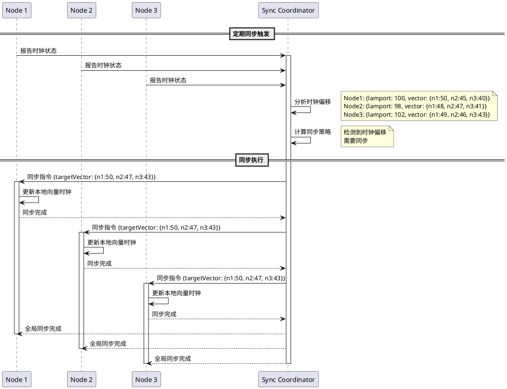
```plantuml
@startuml
participant "Node 1" as N1
participant "Node 2" as N2
participant "Node 3" as N3
participant "Sync Coordinator" as SC

== 定期同步触发 ==
N1 -> SC: 报告时钟状态
activate SC
N2 -> SC: 报告时钟状态
N3 -> SC: 报告时钟状态

SC -> SC: 分析时钟偏移
note right: Node1: {lamport: 100, vector: {n1:50, n2:45, n3:40}}\nNode2: {lamport: 98, vector: {n1:48, n2:47, n3:41}}\nNode3: {lamport: 102, vector: {n1:49, n2:46, n3:43}}

SC -> SC: 计算同步策略
note right: 检测到时钟偏移\n需要同步

== 同步执行 ==
SC -> N1: 同步指令 {targetVector: {n1:50, n2:47, n3:43}}
activate N1
N1 -> N1: 更新本地向量时钟
N1 --> SC: 同步完成

SC -> N2: 同步指令 {targetVector: {n1:50, n2:47, n3:43}}
activate N2
N2 -> N2: 更新本地向量时钟
N2 --> SC: 同步完成

SC -> N3: 同步指令 {targetVector: {n1:50, n2:47, n3:43}}
activate N3
N3 -> N3: 更新本地向量时钟
N3 --> SC: 同步完成

SC --> N1: 全局同步完成
deactivate N1
SC --> N2: 全局同步完成
deactivate N2
SC --> N3: 全局同步完成
deactivate N3
deactivate SC
@enduml
```

### 5.2 数据一致性同步

**参与者**: Primary Node, Secondary Node 1, Secondary Node 2, Consensus Algorithm

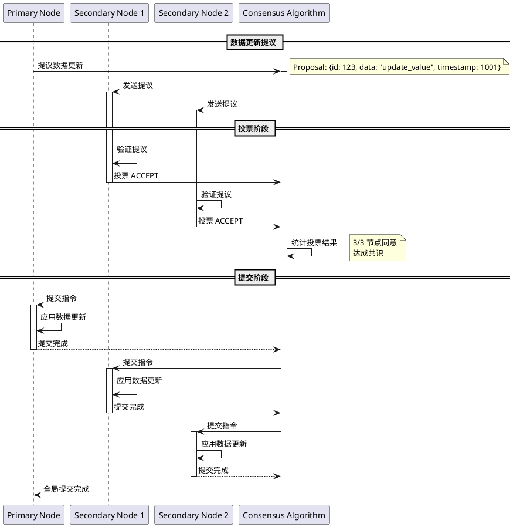
```plantuml
@startuml
participant "Primary Node" as PN
participant "Secondary Node 1" as SN1
participant "Secondary Node 2" as SN2
participant "Consensus Algorithm" as CA

== 数据更新提议 ==
PN -> CA: 提议数据更新
activate CA
note right: Proposal: {id: 123, data: "update_value", timestamp: 1001}

CA -> SN1: 发送提议
activate SN1
CA -> SN2: 发送提议
activate SN2

== 投票阶段 ==
SN1 -> SN1: 验证提议
SN1 -> CA: 投票 ACCEPT
deactivate SN1

SN2 -> SN2: 验证提议
SN2 -> CA: 投票 ACCEPT
deactivate SN2

CA -> CA: 统计投票结果
note right: 3/3 节点同意\n达成共识

== 提交阶段 ==
CA -> PN: 提交指令
activate PN
PN -> PN: 应用数据更新
PN --> CA: 提交完成
deactivate PN

CA -> SN1: 提交指令
activate SN1
SN1 -> SN1: 应用数据更新
SN1 --> CA: 提交完成
deactivate SN1

CA -> SN2: 提交指令
activate SN2
SN2 -> SN2: 应用数据更新
SN2 --> CA: 提交完成
deactivate SN2

CA --> PN: 全局提交完成
deactivate CA
@enduml
```

---

## 6. 故障恢复用例

### 6.1 节点故障检测与恢复

**参与者**: Health Monitor, Failed Node, Healthy Node 1, Healthy Node 2, Load Balancer

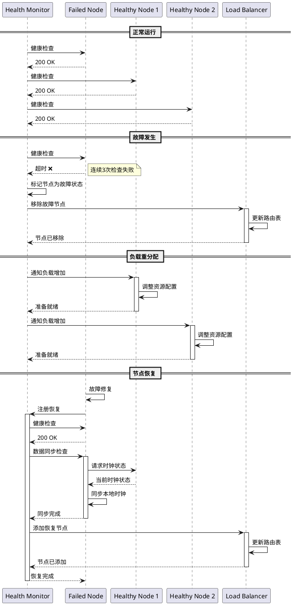
```plantuml
@startuml
participant "Health Monitor" as HM
participant "Failed Node" as FN
participant "Healthy Node 1" as HN1
participant "Healthy Node 2" as HN2
participant "Load Balancer" as LB

== 正常运行 ==
HM -> FN: 健康检查
FN --> HM: 200 OK
HM -> HN1: 健康检查
HN1 --> HM: 200 OK
HM -> HN2: 健康检查
HN2 --> HM: 200 OK

== 故障发生 ==
HM -> FN: 健康检查
FN --> HM: 超时 ❌
note right: 连续3次检查失败

HM -> HM: 标记节点为故障状态
HM -> LB: 移除故障节点
activate LB
LB -> LB: 更新路由表
LB --> HM: 节点已移除
deactivate LB

== 负载重分配 ==
HM -> HN1: 通知负载增加
activate HN1
HN1 -> HN1: 调整资源配置
HN1 --> HM: 准备就绪
deactivate HN1

HM -> HN2: 通知负载增加
activate HN2
HN2 -> HN2: 调整资源配置
HN2 --> HM: 准备就绪
deactivate HN2

== 节点恢复 ==
FN -> FN: 故障修复
FN -> HM: 注册恢复
activate HM

HM -> FN: 健康检查
FN --> HM: 200 OK

HM -> FN: 数据同步检查
activate FN
FN -> HN1: 请求时钟状态
HN1 --> FN: 当前时钟状态
FN -> FN: 同步本地时钟
FN --> HM: 同步完成
deactivate FN

HM -> LB: 添加恢复节点
activate LB
LB -> LB: 更新路由表
LB --> HM: 节点已添加
deactivate LB

HM --> FN: 恢复完成
deactivate HM
@enduml
```

### 6.2 分布式事务故障恢复

**参与者**: Transaction Manager, Resource Manager A, Resource Manager B, Recovery Service

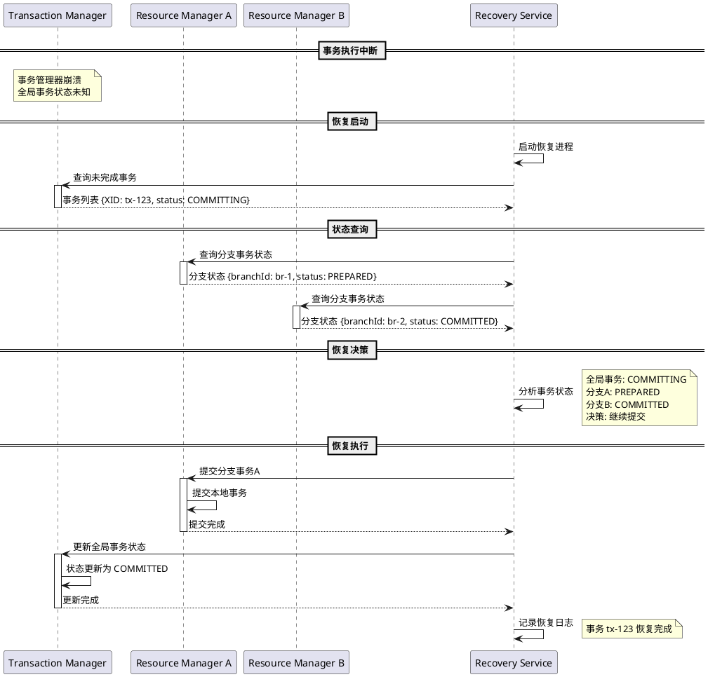
```plantuml
@startuml
participant "Transaction Manager" as TM
participant "Resource Manager A" as RMA
participant "Resource Manager B" as RMB
participant "Recovery Service" as RS

== 事务执行中断 ==
note over TM: 事务管理器崩溃\n全局事务状态未知

== 恢复启动 ==
RS -> RS: 启动恢复进程
RS -> TM: 查询未完成事务
activate TM
TM --> RS: 事务列表 {XID: tx-123, status: COMMITTING}
deactivate TM

== 状态查询 ==
RS -> RMA: 查询分支事务状态
activate RMA
RMA --> RS: 分支状态 {branchId: br-1, status: PREPARED}
deactivate RMA

RS -> RMB: 查询分支事务状态
activate RMB
RMB --> RS: 分支状态 {branchId: br-2, status: COMMITTED}
deactivate RMB

== 恢复决策 ==
RS -> RS: 分析事务状态
note right: 全局事务: COMMITTING\n分支A: PREPARED\n分支B: COMMITTED\n决策: 继续提交

== 恢复执行 ==
RS -> RMA: 提交分支事务A
activate RMA
RMA -> RMA: 提交本地事务
RMA --> RS: 提交完成
deactivate RMA

RS -> TM: 更新全局事务状态
activate TM
TM -> TM: 状态更新为 COMMITTED
TM --> RS: 更新完成
deactivate TM

RS -> RS: 记录恢复日志
note right: 事务 tx-123 恢复完成
@enduml
```

---

## 7. 性能监控用例

### 7.1 实时性能监控

**参与者**: Metrics Collector, DTS Service, Prometheus, Grafana, Alert Manager

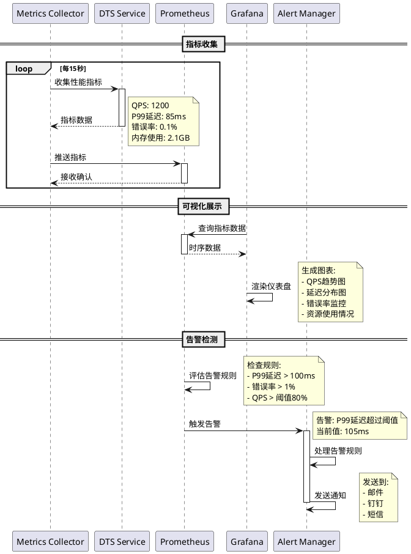
```plantuml
@startuml
participant "Metrics Collector" as MC
participant "DTS Service" as DTS
participant Prometheus
participant Grafana
participant "Alert Manager" as AM

== 指标收集 ==
loop 每15秒
    MC -> DTS: 收集性能指标
    activate DTS
    DTS --> MC: 指标数据
    deactivate DTS
    note right: QPS: 1200\nP99延迟: 85ms\n错误率: 0.1%\n内存使用: 2.1GB
    
    MC -> Prometheus: 推送指标
    activate Prometheus
    Prometheus --> MC: 接收确认
    deactivate Prometheus
end

== 可视化展示 ==
Grafana -> Prometheus: 查询指标数据
activate Prometheus
Prometheus --> Grafana: 时序数据
deactivate Prometheus

Grafana -> Grafana: 渲染仪表盘
note right: 生成图表:\n- QPS趋势图\n- 延迟分布图\n- 错误率监控\n- 资源使用情况

== 告警检测 ==
Prometheus -> Prometheus: 评估告警规则
note right: 检查规则:\n- P99延迟 > 100ms\n- 错误率 > 1%\n- QPS > 阈值80%

Prometheus -> AM: 触发告警
activate AM
note right: 告警: P99延迟超过阈值\n当前值: 105ms

AM -> AM: 处理告警规则
AM -> AM: 发送通知
note right: 发送到:\n- 邮件\n- 钉钉\n- 短信
deactivate AM
@enduml
```

---

## 8. 总结

本文档详细描述了分布式时间戳系统中各个用例的时序流程，包括：

1. **核心时间戳功能**：Lamport时间戳、版本向量、向量时钟的生成和同步
2. **分布式事务管理**：Seata AT/TCC/SAGA模式的完整流程
3. **XA 事务管理**：基于 JTA 的 XA 分布式事务处理
4. **JTA 事务管理**：高级 JTA 事务管理和复杂业务场景处理
5. **系统管理功能**：节点同步、故障恢复、性能监控等

这些时序图可以用于：
- 系统设计和架构评审
- 开发人员理解业务流程
- 测试用例设计和验证
- 问题排查和性能优化
- 新团队成员的培训和学习

所有时序图都采用PlantUML格式，可以直接在支持PlantUML的工具中渲染查看。

## XA 事务时序

### XA 事务执行流程

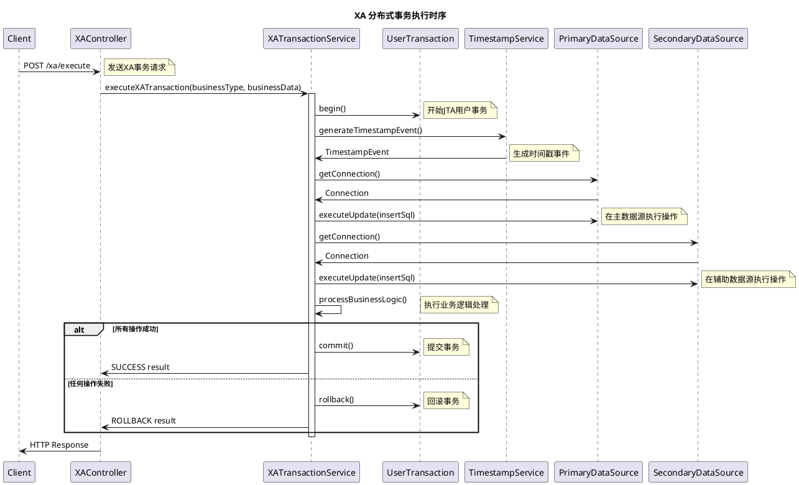
```plantuml
@startuml XA Transaction Execution
title XA 分布式事务执行时序

participant "Client" as C
participant "XAController" as XAC
participant "XATransactionService" as XAS
participant "UserTransaction" as UT
participant "TimestampService" as TS
participant "PrimaryDataSource" as PDS
participant "SecondaryDataSource" as SDS

C -> XAC: POST /xa/execute
note right: 发送XA事务请求

XAC -> XAS: executeXATransaction(businessType, businessData)
activate XAS

XAS -> UT: begin()
note right: 开始JTA用户事务

XAS -> TS: generateTimestampEvent()
TS -> XAS: TimestampEvent
note right: 生成时间戳事件

XAS -> PDS: getConnection()
PDS -> XAS: Connection
XAS -> PDS: executeUpdate(insertSql)
note right: 在主数据源执行操作

XAS -> SDS: getConnection()
SDS -> XAS: Connection
XAS -> SDS: executeUpdate(insertSql)
note right: 在辅助数据源执行操作

XAS -> XAS: processBusinessLogic()
note right: 执行业务逻辑处理

alt 所有操作成功
    XAS -> UT: commit()
    note right: 提交事务
    XAS -> XAC: SUCCESS result
else 任何操作失败
    XAS -> UT: rollback()
    note right: 回滚事务
    XAS -> XAC: ROLLBACK result
end

deactivate XAS
XAC -> C: HTTP Response
@enduml
```

### XA 批量事务处理流程

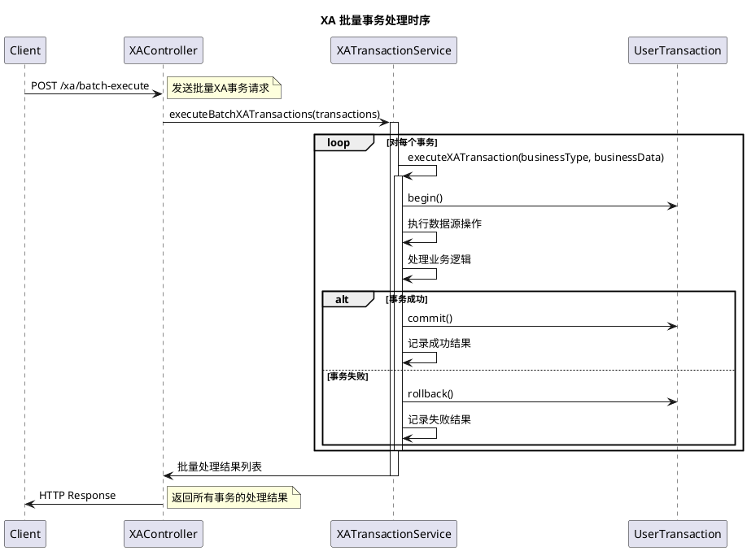
```plantuml
@startuml XA Batch Transaction Processing
title XA 批量事务处理时序

participant "Client" as C
participant "XAController" as XAC
participant "XATransactionService" as XAS
participant "UserTransaction" as UT

C -> XAC: POST /xa/batch-execute
note right: 发送批量XA事务请求

XAC -> XAS: executeBatchXATransactions(transactions)
activate XAS

loop 对每个事务
    XAS -> XAS: executeXATransaction(businessType, businessData)
    activate XAS
    
    XAS -> UT: begin()
    XAS -> XAS: 执行数据源操作
    XAS -> XAS: 处理业务逻辑
    
    alt 事务成功
        XAS -> UT: commit()
        XAS -> XAS: 记录成功结果
    else 事务失败
        XAS -> UT: rollback()
        XAS -> XAS: 记录失败结果
    end
    
    deactivate XAS
end

XAS -> XAC: 批量处理结果列表
deactivate XAS

XAC -> C: HTTP Response
note right: 返回所有事务的处理结果
@enduml
```

### XA 异步事务处理流程

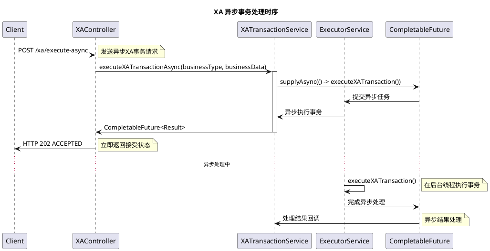
```plantuml
@startuml XA Async Transaction Processing
title XA 异步事务处理时序

participant "Client" as C
participant "XAController" as XAC
participant "XATransactionService" as XAS
participant "ExecutorService" as ES
participant "CompletableFuture" as CF

C -> XAC: POST /xa/execute-async
note right: 发送异步XA事务请求

XAC -> XAS: executeXATransactionAsync(businessType, businessData)
activate XAS

XAS -> CF: supplyAsync(() -> executeXATransaction())
CF -> ES: 提交异步任务
ES -> XAS: 异步执行事务

XAS -> XAC: CompletableFuture<Result>
deactivate XAS

XAC -> C: HTTP 202 ACCEPTED
note right: 立即返回接受状态

... 异步处理中 ...

ES -> ES: executeXATransaction()
note right: 在后台线程执行事务

ES -> CF: 完成异步处理
CF -> XAS: 处理结果回调
note right: 异步结果处理
@enduml
```

## JTA 事务时序

### JTA 事务执行流程

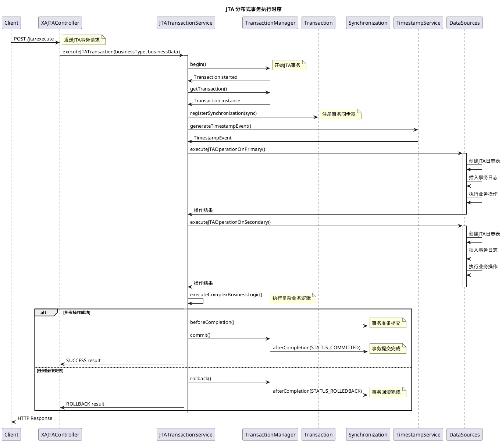
```plantuml
@startuml JTA Transaction Execution
title JTA 分布式事务执行时序

participant "Client" as C
participant "XAJTAController" as XJTAC
participant "JTATransactionService" as JTAS
participant "TransactionManager" as TM
participant "Transaction" as T
participant "Synchronization" as S
participant "TimestampService" as TS
participant "DataSources" as DS

C -> XJTAC: POST /jta/execute
note right: 发送JTA事务请求

XJTAC -> JTAS: executeJTATransaction(businessType, businessData)
activate JTAS

JTAS -> TM: begin()
note right: 开始JTA事务

TM -> JTAS: Transaction started
JTAS -> TM: getTransaction()
TM -> JTAS: Transaction instance

JTAS -> T: registerSynchronization(sync)
note right: 注册事务同步器

JTAS -> TS: generateTimestampEvent()
TS -> JTAS: TimestampEvent

JTAS -> DS: executeJTAOperationOnPrimary()
activate DS
DS -> DS: 创建JTA日志表
DS -> DS: 插入事务日志
DS -> DS: 执行业务操作
DS -> JTAS: 操作结果
deactivate DS

JTAS -> DS: executeJTAOperationOnSecondary()
activate DS
DS -> DS: 创建JTA日志表
DS -> DS: 插入事务日志
DS -> DS: 执行业务操作
DS -> JTAS: 操作结果
deactivate DS

JTAS -> JTAS: executeComplexBusinessLogic()
note right: 执行复杂业务逻辑

alt 所有操作成功
    JTAS -> S: beforeCompletion()
    note right: 事务准备提交
    
    JTAS -> TM: commit()
    TM -> S: afterCompletion(STATUS_COMMITTED)
    note right: 事务提交完成
    
    JTAS -> XJTAC: SUCCESS result
else 任何操作失败
    JTAS -> TM: rollback()
    TM -> S: afterCompletion(STATUS_ROLLEDBACK)
    note right: 事务回滚完成
    
    JTAS -> XJTAC: ROLLBACK result
end

deactivate JTAS
XJTAC -> C: HTTP Response
@enduml
```

### JTA 复杂订单处理流程

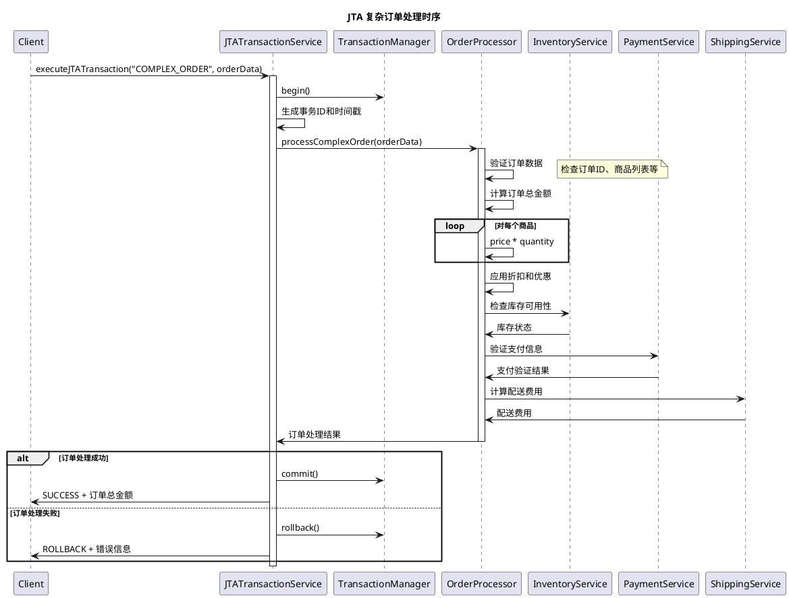
```plantuml
@startuml JTA Complex Order Processing
title JTA 复杂订单处理时序

participant "Client" as C
participant "JTATransactionService" as JTAS
participant "TransactionManager" as TM
participant "OrderProcessor" as OP
participant "InventoryService" as IS
participant "PaymentService" as PS
participant "ShippingService" as SS

C -> JTAS: executeJTATransaction("COMPLEX_ORDER", orderData)
activate JTAS

JTAS -> TM: begin()
JTAS -> JTAS: 生成事务ID和时间戳

JTAS -> OP: processComplexOrder(orderData)
activate OP

OP -> OP: 验证订单数据
note right: 检查订单ID、商品列表等

OP -> OP: 计算订单总金额
loop 对每个商品
    OP -> OP: price * quantity
end
OP -> OP: 应用折扣和优惠

OP -> IS: 检查库存可用性
IS -> OP: 库存状态

OP -> PS: 验证支付信息
PS -> OP: 支付验证结果

OP -> SS: 计算配送费用
SS -> OP: 配送费用

OP -> JTAS: 订单处理结果
deactivate OP

alt 订单处理成功
    JTAS -> TM: commit()
    JTAS -> C: SUCCESS + 订单总金额
else 订单处理失败
    JTAS -> TM: rollback()
    JTAS -> C: ROLLBACK + 错误信息
end

deactivate JTAS
@enduml
```

### JTA 批量更新处理流程

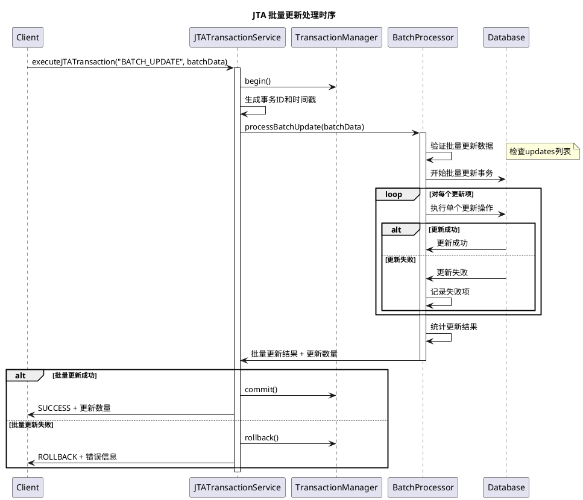
```plantuml
@startuml JTA Batch Update Processing
title JTA 批量更新处理时序

participant "Client" as C
participant "JTATransactionService" as JTAS
participant "TransactionManager" as TM
participant "BatchProcessor" as BP
participant "Database" as DB

C -> JTAS: executeJTATransaction("BATCH_UPDATE", batchData)
activate JTAS

JTAS -> TM: begin()
JTAS -> JTAS: 生成事务ID和时间戳

JTAS -> BP: processBatchUpdate(batchData)
activate BP

BP -> BP: 验证批量更新数据
note right: 检查updates列表

BP -> DB: 开始批量更新事务
loop 对每个更新项
    BP -> DB: 执行单个更新操作
    alt 更新成功
        DB -> BP: 更新成功
    else 更新失败
        DB -> BP: 更新失败
        BP -> BP: 记录失败项
    end
end

BP -> BP: 统计更新结果
BP -> JTAS: 批量更新结果 + 更新数量
deactivate BP

alt 批量更新成功
    JTAS -> TM: commit()
    JTAS -> C: SUCCESS + 更新数量
else 批量更新失败
    JTAS -> TM: rollback()
    JTAS -> C: ROLLBACK + 错误信息
end

deactivate JTAS
@enduml
```

### JTA 数据迁移处理流程

```plantuml
@startuml JTA Data Migration Processing
title JTA 数据迁移处理时序

participant "Client" as C
participant "JTATransactionService" as JTAS
participant "TransactionManager" as TM
participant "MigrationProcessor" as MP
participant "SourceDB" as SDB
participant "TargetDB" as TDB

C -> JTAS: executeJTATransaction("DATA_MIGRATION", migrationData)
activate JTAS

JTAS -> TM: begin()
JTAS -> JTAS: 生成事务ID和时间戳

JTAS -> MP: processDataMigration(migrationData)
activate MP

MP -> MP: 验证迁移配置
note right: 检查源表、目标表、迁移规则

MP -> SDB: 连接源数据库
MP -> TDB: 连接目标数据库

MP -> SDB: 查询源表结构
SDB -> MP: 表结构信息

MP -> TDB: 创建或验证目标表
TDB -> MP: 目标表准备就绪

MP -> MP: 准备数据转换规则
loop 按批次处理数据
    MP -> SDB: 读取批次数据
    SDB -> MP: 源数据批次
    
    MP -> MP: 应用转换规则
    note right: 字段映射、数据转换
    
    MP -> TDB: 写入转换后的数据
    TDB -> MP: 写入结果
end

MP -> MP: 验证迁移完整性
MP -> JTAS: 数据迁移完成
deactivate MP

alt 数据迁移成功
    JTAS -> TM: commit()
    JTAS -> C: SUCCESS + 迁移统计
else 数据迁移失败
    JTAS -> TM: rollback()
    JTAS -> C: ROLLBACK + 错误信息
end

deactivate JTAS
@enduml
```

### JTA 事务状态管理流程

```plantuml
@startuml JTA Transaction Status Management
title JTA 事务状态管理时序

participant "Client" as C
participant "JTATransactionService" as JTAS
participant "TransactionStatusMap" as TSM
participant "TransactionSynchronization" as TS

C -> JTAS: executeJTATransaction()
activate JTAS

JTAS -> TSM: put(transactionId, ACTIVE)
note right: 记录事务为活跃状态

JTAS -> TS: new TransactionSynchronization(transactionId)
JTAS -> JTAS: 注册同步器

JTAS -> JTAS: 执行业务操作

JTAS -> TSM: put(transactionId, PREPARING)
note right: 更新状态为准备中

JTAS -> TS: beforeCompletion()
TS -> TSM: put(transactionId, PREPARING)

alt 事务提交
    JTAS -> TSM: put(transactionId, COMMITTING)
    JTAS -> JTAS: commit()
    TS -> TS: afterCompletion(STATUS_COMMITTED)
    TS -> TSM: put(transactionId, COMMITTED)
else 事务回滚
    JTAS -> TSM: put(transactionId, ROLLING_BACK)
    JTAS -> JTAS: rollback()
    TS -> TS: afterCompletion(STATUS_ROLLEDBACK)
    TS -> TSM: put(transactionId, ROLLED_BACK)
end

deactivate JTAS

... 后续查询 ...

C -> JTAS: getJTATransactionStatus(transactionId)
JTAS -> TSM: get(transactionId)
TSM -> JTAS: TransactionStatus
JTAS -> C: 事务状态信息
@enduml
```

## XA/JTA 错误处理时序

### XA 事务回滚流程

```plantuml
@startuml XA Transaction Rollback
title XA 事务回滚处理时序

participant "XATransactionService" as XAS
participant "UserTransaction" as UT
participant "PrimaryDataSource" as PDS
participant "SecondaryDataSource" as SDS
participant "BusinessLogic" as BL

XAS -> UT: begin()
XAS -> PDS: 执行主数据源操作
PDS -> XAS: 操作成功

XAS -> SDS: 执行辅助数据源操作
SDS -> XAS: 操作成功

XAS -> BL: 执行业务逻辑
BL -> XAS: 抛出业务异常
note right: 业务逻辑验证失败

XAS -> XAS: 捕获异常
XAS -> UT: rollback()
note right: 回滚所有XA资源

UT -> PDS: XA rollback
PDS -> UT: 回滚完成

UT -> SDS: XA rollback
SDS -> UT: 回滚完成

UT -> XAS: 回滚完成

XAS -> XAS: 构造错误响应
note right: status: ROLLBACK, error: 异常信息
@enduml
```

### JTA 事务异常处理流程

```plantuml
@startuml JTA Transaction Exception Handling
title JTA 事务异常处理时序

participant "JTATransactionService" as JTAS
participant "TransactionManager" as TM
participant "Transaction" as T
participant "Synchronization" as S
participant "DataSource" as DS

JTAS -> TM: begin()
TM -> JTAS: Transaction started

JTAS -> T: registerSynchronization(sync)
JTAS -> DS: 执行数据库操作

DS -> JTAS: 抛出SQL异常
note right: 数据库约束违反

JTAS -> JTAS: 捕获异常并记录
JTAS -> TM: rollback()

TM -> S: afterCompletion(STATUS_ROLLEDBACK)
S -> JTAS: 同步器回调完成

alt 回滚成功
    JTAS -> JTAS: 构造回滚响应
    note right: status: ROLLBACK, finalStatus: ROLLED_BACK
else 回滚失败
    TM -> JTAS: 抛出回滚异常
    JTAS -> JTAS: 构造回滚失败响应
    note right: status: ROLLBACK_FAILED, finalStatus: UNKNOWN
end
@enduml
```

## 总结

本文档详细描述了分布式时间戳系统中各个用例的时序流程，包括：

1. **核心时间戳功能**：Lamport时间戳、版本向量、向量时钟的生成和同步
2. **分布式事务管理**：Seata AT/TCC/SAGA模式的完整流程
3. **XA 事务管理**：基于 JTA 的 XA 分布式事务处理
4. **JTA 事务管理**：高级 JTA 事务管理和复杂业务场景处理
5. **系统管理功能**：节点同步、故障恢复、性能监控等

这些时序图可以用于：
- 系统设计和架构评审
- 开发人员理解业务流程
- 测试用例设计和验证
- 问题排查和性能优化
- 新团队成员的培训和学习

所有时序图都采用PlantUML格式，可以直接在支持PlantUML的工具中渲染查看。